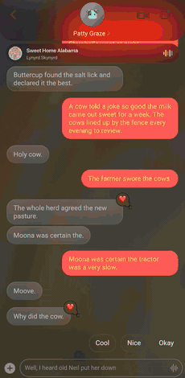
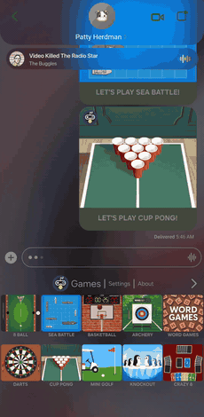

# CowBubbles

A fork of [OpenBubbles](https://github.com/OpenBubbles/openbubbles-app) with a rebuilt interface: liquid glass surfaces, per-conversation colour, and a now-playing engine that themes the app around whatever you are listening to.

Everything OpenBubbles does, it still does. This is the same messaging core wearing a different app.

## What's different

**Music theming.** A media listener watches whatever is playing and hands the track to the UI. The conversation background is the album art itself, three copies of a 28px thumbnail rotating and drifting under a fragment shader, which is how the colour keeps moving without a full-screen blur every frame. Outgoing bubbles take the cover's most saturated colour.

**Lyrics.** Synced lyrics from LRCLIB. A chip under the header shows the current line. Hold it and a panel peeks open; keep holding and pull down for the full screen. Lines are centred, the current one swells, the rest go soft. Instrumental breaks get three dots that fill across the length of the break.

**Colour as information.** Every conversation gets a colour from its handle, quantised onto a 12-step OKLCH wheel so no two threads in a list land a few degrees apart. Unread chats fill with their colour, read ones go flat.

**Cow theming.** Circular avatars, a cow-spot silhouette for groups, and a redacted mode that swaps names for cow puns and messages for cow riddles.

## Screens

| Music theming | iMessage apps |
|---|---|
|  |  |

## Status

Alpha. Android only, arm64. Built and tested on a Galaxy S24.

The APK on the releases page is signed with a personal key, so it installs alongside a stock OpenBubbles install rather than updating it.

## Building

Standard Flutter build against the `cow` flavor:

```
flutter build apk --release --flavor cow --target-platform android-arm64
```

Note that a build from source cannot authenticate with Apple: the fairplay certificates and the Absinthe validation code are withheld upstream and ship as stubs. That limitation is inherited from OpenBubbles and is not something this fork changes.

## Credit

All of the messaging, sync and Apple-service work is [OpenBubbles](https://github.com/OpenBubbles/openbubbles-app) and [rustpush](https://github.com/TaeHagen/rustpush). This fork only touches the interface.

Licensed Apache 2.0, as upstream. `rustpush/` is SSPL with an exception granted to OpenBubbles specifically.
